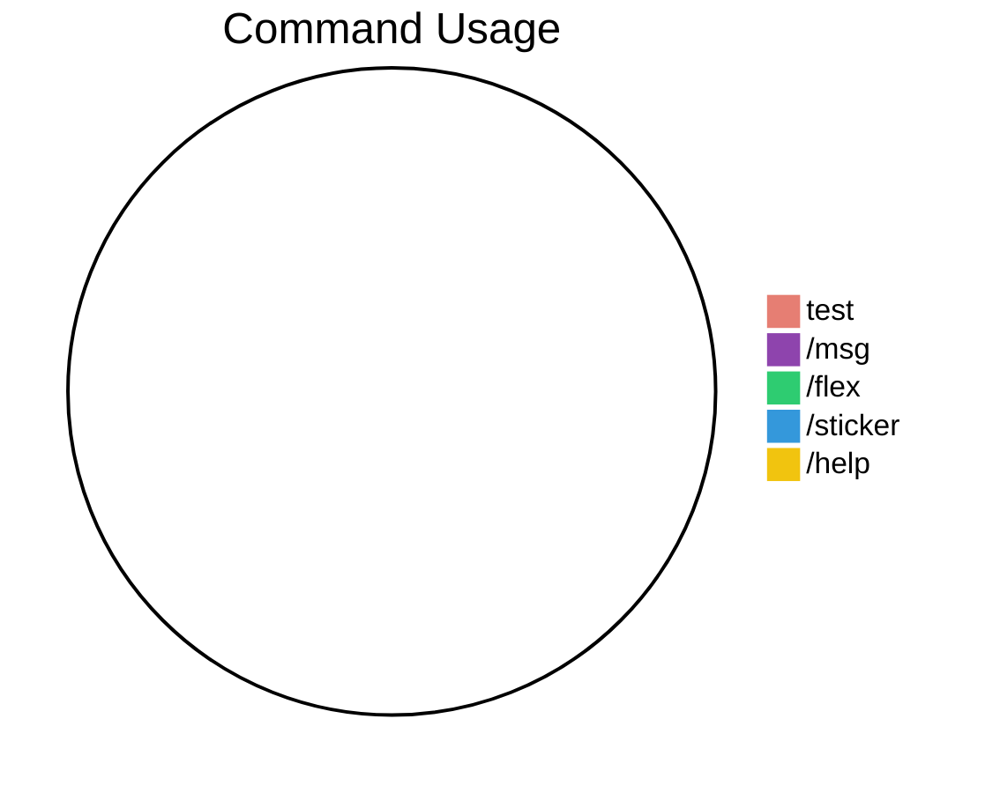

# nezu-works-bot

## SDK Version
Current LINE WORKS SDK version: 3.7

Hi!! I'm **Nezu-Works** :)

This repository is for testing purposes only and is not intended for public use.

## Statistics

* Error count: 0
* Total message received: 0
* Total command used: 0
* Command usage rate: 0%

### Command Usage Graphs

Last updated: 2025-07-13 06:22:22 UTC
